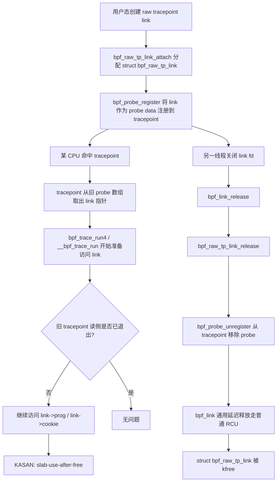
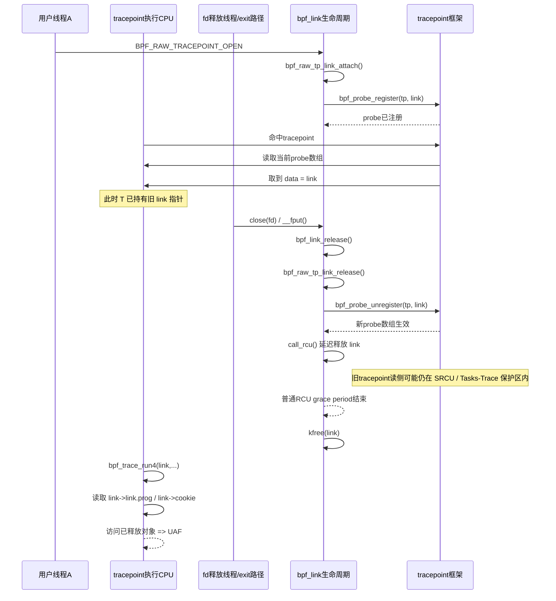

# syzbot: `KASAN: slab-use-after-free Read in bpf_trace_run4` 场景分析

## 1. 问题概览

该问题来自 syzbot 报告：`KASAN: slab-use-after-free Read in bpf_trace_run4`。

从调用栈与对象生命周期看，这是一个 **raw tracepoint BPF link 在注销后仍被 tracepoint 回调访问** 的并发 use-after-free 问题。

核心对象与路径如下：

- 分配：`bpf_raw_tp_link_attach()` 在 [kernel/bpf/syscall.c](../../kernel/bpf/syscall.c#L4222-L4278)
- 回调执行：`bpf_trace_run4()` / `__bpf_trace_run()` 在 [kernel/trace/bpf_trace.c](../../kernel/trace/bpf_trace.c#L2073-L2131)
- 注销：`bpf_raw_tp_link_release()` 在 [kernel/bpf/syscall.c](../../kernel/bpf/syscall.c#L3779-L3785)
- 延迟释放：`bpf_link_free()` 在 [kernel/bpf/syscall.c](../../kernel/bpf/syscall.c#L3294-L3317)
- tracepoint probe 回收模型：`release_probes()` 在 [kernel/tracepoint.c](../../kernel/tracepoint.c#L115-L127)
- tracepoint 注销同步语义：`tracepoint_synchronize_unregister()` 在 [include/linux/tracepoint.h](../../include/linux/tracepoint.h#L104-L121)

---

## 2. 涉及的数据结构

`raw tracepoint` 链接对象定义如下：

- `struct bpf_raw_tp_link` 在 [include/linux/bpf.h](../../include/linux/bpf.h#L1892-L1896)

其关键成员为：

- `link.link.prog`：执行时要读取的 `BPF program`
- `btp`：指向 raw tracepoint 元信息
- `cookie`：执行上下文中要读取的 cookie

而 `bpf_trace_runX()` 的原型表明，tracepoint 命中时会把 `struct bpf_raw_tp_link *link` 直接作为探针私有数据传入：

- 原型声明见 [include/linux/trace_events.h](../../include/linux/trace_events.h#L900-L929)

这意味着：**一旦 tracepoint 回调开始运行，它会直接解引用 `link` 指针。**

---

## 3. 触发现场的高层描述

一个典型场景是：

1. 用户态通过 `BPF_RAW_TRACEPOINT_OPEN` 创建 raw tracepoint link；
2. 该 link 注册到某个 tracepoint（本例中栈上出现 `mm_page_alloc`）；
3. 另一个线程/任务关闭该 link 的 fd，导致 `bpf_link_release()` 执行；
4. 释放路径调用 `bpf_raw_tp_link_release()`，把 probe 从 tracepoint 中移除；
5. 但此时某个 CPU 上已经有一个 tracepoint 调用在飞行中，仍持有旧 probe 数组里的 `link` 指针；
6. `bpf_link` 通用延迟释放路径先按普通 `RCU` 回收了 `struct bpf_raw_tp_link`；
7. 尚未退出的 tracepoint 读侧随后进入 `bpf_trace_run4()`，继续访问已经释放的 `link`；
8. `KASAN` 报告 `slab-use-after-free`。

这里的关键不是“注销失败”，而是：

> **tracepoint 读侧的退出时机，晚于 `bpf_raw_tp_link` 对象实际被释放的时机。**

---

## 4. 创建、注销、执行三条路径

### 4.1 创建路径

`bpf_raw_tp_link_attach()` 做了几件关键事情：

1. 解析 tracepoint 名称；
2. 通过 `bpf_get_raw_tracepoint()` 找到目标 `btp`；
3. `kzalloc_obj(*link, GFP_USER)` 分配 `struct bpf_raw_tp_link`；
4. 初始化 `link`；
5. 调用 `bpf_probe_register(link->btp, link)` 把该对象作为 tracepoint probe 的 `data` 注册进去。

也就是说，**tracepoint 框架后续保存并传播的是这个 `link` 指针本身**。

### 4.2 执行路径

raw tracepoint 触发时，会走到 `bpf_trace_run4()`，再进入 `__bpf_trace_run()`：

- `prog = link->link.prog;`
- `run_ctx.bpf_cookie = link->cookie;`
- `bpf_prog_run(prog, args);`

见 [kernel/trace/bpf_trace.c](../../kernel/trace/bpf_trace.c#L2073-L2087)。

因此只要 `link` 被提前释放，下面这些读取都会变成 UAF：

- `link->link.prog`
- `link->cookie`

这与 syzbot 报告里“读地址位于已释放对象内部 24 bytes”完全吻合。

### 4.3 注销与释放路径

关闭 fd 后，最终走到：

1. `bpf_link_release()`
2. `bpf_link_put_direct()`
3. `bpf_link_free()`
4. `ops->release(link)` → `bpf_raw_tp_link_release()`
5. 然后根据 `dealloc_deferred` 安排异步回收

`bpf_raw_tp_link_release()` 当前只做：

- `bpf_probe_unregister(raw_tp->btp, raw_tp);`
- `bpf_put_raw_tracepoint(raw_tp->btp);`

见 [kernel/bpf/syscall.c](../../kernel/bpf/syscall.c#L3779-L3785)。

它**没有显式等待 tracepoint 现有读侧彻底退出**。

---

## 5. 为什么会发生 UAF

### 5.1 表面现象

从表面看，代码已经执行了 `bpf_probe_unregister()`，似乎 probe 已经不再可见。

但问题在于：

- “从 tracepoint 的 probe 数组中移除”
- “没有任何 CPU 再持有旧 probe/data 指针”
- “可以安全释放 `struct bpf_raw_tp_link`”

这三件事不是同一个时间点发生的。

### 5.2 tracepoint 的同步模型

tracepoint 更新 probe 数组后，旧数组不是立即释放，而是走延迟回收：

- faultable tracepoint：`call_rcu_tasks_trace()`
- 非 faultable tracepoint：`call_srcu(&tracepoint_srcu, ...)`

见 [kernel/tracepoint.c](../../kernel/tracepoint.c#L115-L127)。

头文件也明确说明：

- 在最后一次 unregistration 之后，需要 `tracepoint_synchronize_unregister()`；
- 或者采用与 tracepoint 自身一致的回收模型。

见 [include/linux/tracepoint.h](../../include/linux/tracepoint.h#L104-L121)。

### 5.3 `bpf_link` 的回收模型不匹配

`bpf_raw_tp_link` 走的是 `bpf_link` 的通用延迟释放路径。

在当前实现里，若 `link->sleepable` 和 `prog->sleepable` 不要求更强同步，则会直接：

- `call_rcu(&link->rcu, bpf_link_defer_dealloc_rcu_gp)`

见 [kernel/bpf/syscall.c](../../kernel/bpf/syscall.c#L3307-L3314)。

问题就在这里：

- tracepoint 读侧是否全部退出，受 `SRCU` / `RCU Tasks Trace` 保护；
- `bpf_link` 对象却可能仅在普通 `RCU` grace period 后就被释放。

于是就产生了时序错位：

> tracepoint 还允许旧读者继续跑，`bpf_raw_tp_link` 却已经被普通 `RCU` 回收了。

---

## 6. 触发场景流程图

---

## 7. 并发时序图

---

## 8. 为什么 syzbot 栈能说明这个问题

syzkaller 页面中的关键信息与上述模型完全对应：

### 8.1 访问栈

访问发生在：

- `bpf_trace_run4()`
- `__bpf_trace_run()`

说明崩溃点正是 tracepoint 回调在使用 `link`。

### 8.2 分配栈

分配来自：

- `bpf_raw_tp_link_attach()`

说明被释放的对象正是 `struct bpf_raw_tp_link`。

### 8.3 释放栈

释放来自：

- `bpf_link_release()`
- `bpf_link_put_direct()`
- `call_rcu()`
- 最终 `kfree()`

说明对象经由 `bpf_link` 的通用普通 `RCU` 延迟回收释放。

这三条栈合并起来，基本就把 bug 模型钉死了：

> `raw tracepoint` 仍可能并发使用 `link`，但 `link` 已经被 `bpf_link` 通用释放路径回收。

---

## 9. 一个更贴近实际的触发画面

可以把它想象成下面的竞态：

- CPU0 正在处理 `mm_page_alloc`，已经从 tracepoint 的旧 probe 数组里拿到了 `link`；
- CPU1 上用户进程退出或关闭 fd，触发 `bpf_link_release()`；
- CPU1 把 probe 从 tracepoint 里摘掉，但没有等待 CPU0 手里的旧读侧彻底结束；
- 普通 `RCU` grace period 很快过去，`link` 被释放；
- CPU0 随后进入 `bpf_trace_run4()`，还在读 `link->prog` 和 `link->cookie`；
- KASAN 报告 UAF。

注意：

- **注销成功不代表旧执行实例已经消失**；
- **新读者看不见，不等于旧读者已经退出**。

这正是很多 probe / trace / notifier 生命周期 bug 的典型模式。

---

## 10. 根因总结

根因可以归纳为一句话：

> `struct bpf_raw_tp_link` 的释放时机，只对齐了 `bpf_link` 的普通 `RCU` 生命周期，没有对齐 tracepoint 回调实际使用该对象时所依赖的 `SRCU / RCU Tasks Trace` 生命周期。

换句话说，这是一个 **对象所有权已经转交给 tracepoint 读侧，但释放仍按较弱同步模型进行** 的 bug。

---

## 11. 修复方向

### 方向一：最小修复

在 `bpf_raw_tp_link_release()` 中，在 `bpf_probe_unregister()` 之后补充同步，确保所有可能仍在执行的 tracepoint 读侧退出后，再允许对象进入后续回收。

最直接的办法是：

- 调用 `tracepoint_synchronize_unregister()`

优点：

- 语义直接；
- 与 tracepoint 接口文档一致；
- 最容易验证正确性。

代价：

- 可能比精细化方案更重。

### 方向二：更系统的修复

让 `bpf_link` 支持由具体 link 类型定义自己的 deallocation grace period，令 `raw_tp link` 的最终释放与 tracepoint 使用的同步模型完全一致：

- faultable tracepoint：对齐 `RCU Tasks Trace`
- 非 faultable tracepoint：对齐 `tracepoint_srcu`

优点：

- 生命周期模型最准确；
- 避免对所有 raw tracepoint 都采用统一较重同步。

缺点：

- 改动面更大；
- 需要扩展通用 `bpf_link` 基础设施。

---

## 12. 一句话结论

这个 bug 的本质不是“忘了 unregister”，而是：

> **虽然 probe 已经从 tracepoint 的可见集合中移除，但先前已经拿到 `link` 指针的 tracepoint 执行实例仍在运行；与此同时，`bpf_raw_tp_link` 却按普通 `RCU` 被提前释放，最终在 `bpf_trace_run4()` 中触发 UAF。**

---

## 13. 可用于补丁说明的简版摘要

可直接作为提交说明的思路摘要：

- `raw tracepoint` callbacks dereference `struct bpf_raw_tp_link` directly;
- `bpf_raw_tp_link_release()` unregisters the probe, but does not wait for all in-flight tracepoint readers to finish;
- the link object is then reclaimed through the generic `bpf_link` deferred free path using regular `RCU`;
- however tracepoint readers are protected by `SRCU` or `RCU Tasks Trace`, depending on faultability;
- this grace-period mismatch allows `bpf_trace_run4()` to access a freed `bpf_raw_tp_link`.
