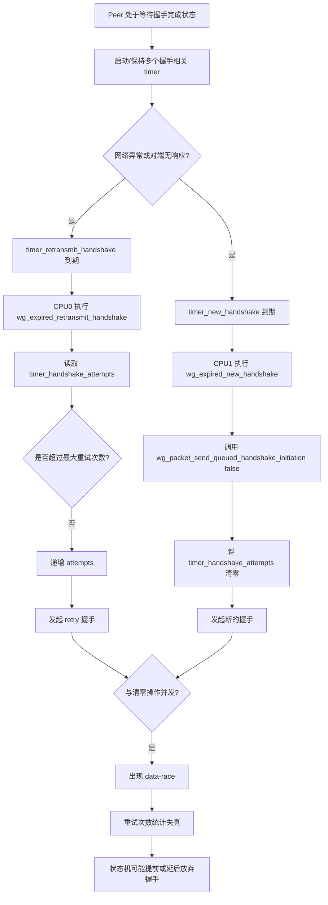
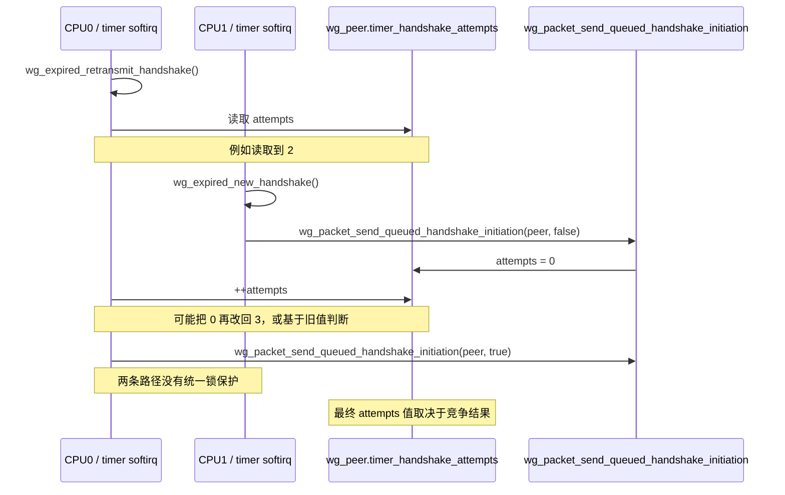

# WireGuard KCSAN data-race 场景分析

## 背景

- **syzkaller 链接**: <https://syzkaller.appspot.com/bug?extid=4ca9a7b9d61b76d0177c>
- **问题标题**: `KCSAN: data-race in wg_expired_retransmit_handshake / wg_packet_send_queued_handshake_initiation`
- **子系统**: `wireguard`
- **问题类型**: 并发数据竞争（KCSAN）

这个问题的核心是：`struct wg_peer` 中的 `timer_handshake_attempts` 被多个定时器回调在不同 CPU 上并发访问，但访问时没有使用锁、原子变量或统一的状态机串行化机制。

相关字段定义位于：

- [drivers/net/wireguard/peer.h](drivers/net/wireguard/peer.h#L48-L60)

---

## 涉及的关键代码路径

### 1. 重传握手定时器

`wg_expired_retransmit_handshake()` 在重传场景下：

- 读取 `peer->timer_handshake_attempts`
- 判断是否超过 `MAX_TIMER_HANDSHAKES`
- 未超过时执行 `++peer->timer_handshake_attempts`
- 再触发一次握手发送

代码位置：

- [drivers/net/wireguard/timers.c](drivers/net/wireguard/timers.c#L41-L74)

### 2. 新握手定时器

`wg_expired_new_handshake()` 在“长时间未收到对端响应”时：

- 调用 `wg_packet_send_queued_handshake_initiation(peer, false)`
- 由于 `is_retry == false`，会先将 `peer->timer_handshake_attempts = 0`

代码位置：

- [drivers/net/wireguard/timers.c](drivers/net/wireguard/timers.c#L93-L105)
- [drivers/net/wireguard/send.c](drivers/net/wireguard/send.c#L56-L77)

### 3. 握手完成路径也会清零

握手完成时，`wg_timers_handshake_complete()` 也会执行：

- `peer->timer_handshake_attempts = 0`

代码位置：

- [drivers/net/wireguard/timers.c](drivers/net/wireguard/timers.c#L195-L200)

因此这个字段并不是只被一个路径修改，而是多个路径共享。

---

## 问题的本质

`timer_handshake_attempts` 承担的是 **握手重试状态机计数器** 的角色。

但是它同时被下面几类执行上下文访问：

1. `timer_retransmit_handshake` 的超时回调
2. `timer_new_handshake` 的超时回调
3. 握手成功后的完成路径

这些路径之间没有统一同步，因此会产生：

- 读写竞争
- 写写竞争
- 计数丢失更新
- 状态机分支判断与真实状态不一致

KCSAN 报告里最典型的一组竞争就是：

- **读方**：`wg_expired_retransmit_handshake()`
- **写方**：`wg_packet_send_queued_handshake_initiation(peer, false)`

---

## 触发场景分析

下面给出一个较容易理解的实际场景。

### 前置条件

1. Peer 已经建立过通信，相关 timer 已经初始化。
2. 因网络抖动、丢包或对端无响应，握手迟迟没有完成。
3. 系统处于多 CPU 环境，softirq/timer 回调可能在不同 CPU 上执行。
4. `timer_retransmit_handshake` 与 `timer_new_handshake` 的超时时间接近，或者由于调度与延迟导致它们重叠执行。

### 典型并发窗口

#### CPU0：执行重传握手回调

`wg_expired_retransmit_handshake()` 开始运行：

1. 读取 `peer->timer_handshake_attempts`
2. 判断是否超过最大重试次数
3. 准备执行 `++peer->timer_handshake_attempts`
4. 调用 `wg_packet_send_queued_handshake_initiation(peer, true)`

#### CPU1：执行新握手回调

几乎同时，`wg_expired_new_handshake()` 开始运行：

1. 调用 `wg_packet_send_queued_handshake_initiation(peer, false)`
2. 因为 `is_retry == false`
3. 直接执行 `peer->timer_handshake_attempts = 0`

于是就形成了下面这种竞争：

- CPU0 正在根据旧值做判断并递增
- CPU1 把计数器清零

最终可能出现：

- CPU0 的递增覆盖 CPU1 的清零
- CPU1 的清零覆盖 CPU0 的递增
- CPU0 根据旧值做出的“是否放弃握手”判断不再成立

---

## 场景流程图

---

## 时序图

下面的时序图展示了 syzbot 抓到的核心竞争窗口。

---

## 为什么 `queue_work()` 不能避免这个 bug

从表面看，两条路径最终都会把握手发送工作排进 `handshake_send_wq`，而 `queue_work()` 能避免同一个 `work_struct` 被重复入队。

但这 **不能修复** 当前 bug，原因是：

1. 竞争发生在 **入队之前**。
2. `wg_packet_send_queued_handshake_initiation(peer, false)` 一进入函数就会先清零 `timer_handshake_attempts`。
3. 即使后续 `queue_work()` 因为工作已在队列中而返回 false，前面的计数器写入也已经发生。

所以，真正竞争的是 **握手状态变量**，不是工作队列本身。

相关代码位置：

- [drivers/net/wireguard/send.c](drivers/net/wireguard/send.c#L56-L77)

---

## 为什么这更像真实 bug，而不是纯 KCSAN 噪声

如果只是统计字段，使用 `READ_ONCE()` / `WRITE_ONCE()` 有时足以说明“这是可接受的无锁读取”。

但这里不是单纯观测值，而是会影响状态机行为：

- 是否继续重试
- 何时放弃握手
- 是否保留/清理暂存数据包

也就是说，这个字段具有明确的控制语义。只要读写并发没有被设计为“最终一致即可”，那么它就不是简单的观测型竞态，而是会影响行为分支的竞态。

---

## 可能的后果

### 1. 重试次数统计失真

本应：

- 第 1 次超时 -> attempts = 1
- 第 2 次超时 -> attempts = 2
- ...
- 达到阈值后停止重试

实际可能变成：

- 在某个时刻被新握手路径清零
- 后续再次从较小值开始累计

### 2. 过早或过晚放弃握手

若 CPU0 使用旧值判断，而 CPU1 同时清零，可能导致：

- 本应继续重试，却提前进入放弃分支
- 本应接近上限，却因为被清零而继续重试更多轮

### 3. 调试与问题定位困难

日志里的 `try N` 可能与真实的握手状态不一致，增加排查难度。

---

## 与握手完成路径的关系

除上述两个 timer 外，握手真正完成时也会清零 `timer_handshake_attempts`：

- [drivers/net/wireguard/timers.c](drivers/net/wireguard/timers.c#L195-L200)

因此，从设计角度看，这个字段实际上同时被：

- 超时重传路径
- 超时重建握手路径
- 握手完成路径

共同维护。

如果没有专门锁把它们串行化，那么类似竞态未来还可能在其他交叉路径上出现。

---

## 根因总结

根因可以概括为一句话：

> WireGuard 的握手 timer 状态机中，`timer_handshake_attempts` 是共享控制状态，但多个定时器/回调路径对它进行了无保护并发访问。

更具体地说：

1. `wg_expired_retransmit_handshake()` 既读又改这个字段。
2. `wg_expired_new_handshake()` 通过 `wg_packet_send_queued_handshake_initiation(peer, false)` 清零这个字段。
3. 这两个路径都可能在不同 CPU 上的 timer softirq 中并发运行。
4. 没有锁，也没有更高层的状态机串行化。

所以 KCSAN 报告的 race 与代码语义是匹配的。

---

## 修复思路简述

这个文档主要分析场景，顺便给出修复方向：

### 方案一：为握手 timer 状态增加锁

把这几个字段放在同一个锁保护下：

- `timer_handshake_attempts`
- `sent_lastminute_handshake`
- `timer_need_another_keepalive`
- 以及相关 timer 状态转换

优点：

- 语义最清晰
- 能解决真实状态机竞争

### 方案二：重构 timer 状态机

例如在发起 `new handshake` 前，明确取消或同步 `retransmit handshake` 状态，避免它们同时操作一个计数器。

优点：

- 从设计上避免共享状态竞争

难点：

- 修改面更大
- 需要非常小心地验证现有握手时序

### 不推荐的最小化做法

仅增加 `READ_ONCE()` / `WRITE_ONCE()`：

- 可以减少 KCSAN 报告
- 但不能解决“读-判断-写”复合状态转换的逻辑竞争

因此它更像“降噪”，不是真正修复。

---

## 结论

这个 bug 产生的典型场景是：

1. Peer 处于握手未完成状态。
2. 由于网络异常，多个握手相关 timer 接连或重叠到期。
3. `wg_expired_retransmit_handshake()` 与 `wg_expired_new_handshake()` 在不同 CPU 上并发执行。
4. 双方同时访问 `peer->timer_handshake_attempts`：一个读取/递增，另一个清零。
5. 由于没有同步机制，触发 KCSAN data-race，并导致握手重试状态机可能失真。

从影响上看，它更偏向 **协议状态机一致性 bug**，而不是直接的内存安全漏洞；但它确实会影响握手重试和放弃策略，因此应视为需要修复的真实并发问题。
